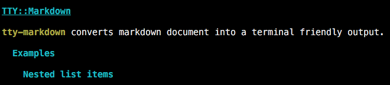
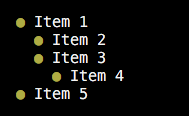
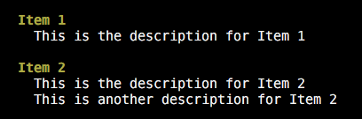
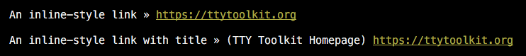
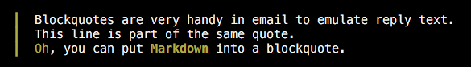
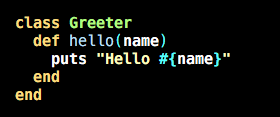
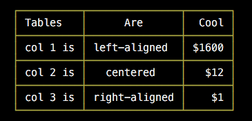
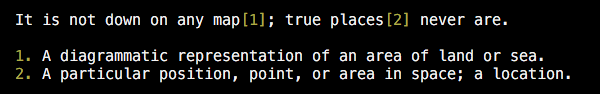

<div align="center">
  <a href="https://ttytoolkit.org"></a>
</div>

# TTY::Markdown

[][gem]
[][gh_actions_ci]
[][appveyor]
[][codeclimate]
[][coverage]

[gem]: https://badge.fury.io/rb/tty-markdown
[gh_actions_ci]: https://github.com/piotrmurach/tty-markdown/actions/workflows/ci.yml
[appveyor]: https://ci.appveyor.com/project/piotrmurach/tty-markdown
[codeclimate]: https://codeclimate.com/github/piotrmurach/tty-markdown/maintainability
[coverage]: https://coveralls.io/github/piotrmurach/tty-markdown

> Convert a Markdown document or text into a terminal friendly output.

**TTY::Markdown** provides a Markdown processing component for the
[TTY Toolkit](https://github.com/piotrmurach/tty).

## Installation

Add this line to your application's Gemfile:

```ruby
gem "tty-markdown"
```

And then execute:

```shell
$ bundle
```

Or install it yourself as:

```shell
$ gem install tty-markdown
```

## Contents

* [1. Usage](#1-usage)
  * [1.1 Header](#11-header)
  * [1.2 List](#12-list)
  * [1.3 Definition List](#13-definition-list)
  * [1.4 Link](#14-link)
  * [1.5 Blockquote](#15-blockquote)
  * [1.6 Code and Syntax Highlighting](#16-code-and-syntax-highlighting)
  * [1.7 Table](#17-table)
  * [1.8 Horizontal Rule](#18-horizontal-rule)
  * [1.9 Footnotes](#19-footnotes)
* [2. Options](#2-options)
  * [2.1 :mode](#21-mode)
  * [2.2 :theme](#22-theme)
  * [2.3 :width](#23-width)
  * [2.4 :symbols](#24-symbols)
  * [2.5 :indent](#25-indent)
  * [2.6 :color](#26-color)
* [3. Command line tool](#3-command-line-tool)

## 1. Usage

Using `parse` method, you can transform a Markdown string into a terminal
formatted content:

```ruby
parsed = TTY::Markdown.parse("# Hello")
puts parsed
# => "\e[36;1mHello\e[0m\n"
```

The `parse_file` allows you to transform a Markdown document into a terminal
formatted output:

```ruby
parsed = TTY::Markdown.parse_file('example.md')
puts parsed
```

### 1.1 Header

Parsing the following Markdown headers:

```markdown
TTY::Markdown
=============

**tty-markdown** converts markdown document into a terminal friendly output.

## Examples

### Nested list items
```

The terminal output looks like this:



### 1.2 List

Both numbered and unordered lists are supported. Given a Markdown:

```markdown
- Item 1
  - Item 2
  - Item 3
    - Item 4
- Item 5
```

The parsed output looks like this:



### 1.3 Definition List

Given a definition list:

```markdown
Item 1
: This is the description for Item 1

Item 2
: This is the description for Item 2
: This is another description for Item 2
```

The parsed output looks like this:



### 1.4 Link

A Markdown link:

```markdown
[An inline-style link](https://ttytoolkit.org)

[An inline-style link with title](https://ttytoolkit.org "TTY Toolkit Homepage")
```

The link text will be rendered with the link next to it:



### 1.5 Blockquote

Given a Markdown quote:

```markdown
> Blockquotes are very handy in email to emulate reply text.
> This line is part of the same quote.
> *Oh*, you can put **Markdown** into a blockquote.
```

The rendered output looks like this:



### 1.6 Code and Syntax Highlighting

The parser can highlight syntax of many programming languages.

Given a Markdown codeblock with a language specification:

````markdown
```ruby
class Greeter
  def hello(name)
    puts "Hello #{name}"
  end
end
```
````

The terminal output will look like this:



### 1.7 Table

You can transform tables which understand the Markdown alignment.

For example, given the following table:

```markdown
| Tables   |      Are      |  Cool |
|----------|:-------------:|------:|
| col 1 is |  left-aligned | $1600 |
| col 2 is |    centered   |   $12 |
| col 3 is | right-aligned |    $1 |
```

Then the terminal output will look like this:



### 1.8 Horizontal Rule

You can specify a horizontal rule in Markdown:

```markdown
***
```

and then transform it:

```ruby
parsed = TTY::Markdown.parse(markdown_string)
```

`puts parsed` will output:


### 1.9 Footnotes

You can create footnote references:

```markdown
It is not down on any map[^foo]; true places[^bar] never are.

[^foo]: A diagrammatic representation of an area of land or sea.
[^bar]: A particular position, point, or area in space; a location.
```

All footnotes will be displayed with a sequential number and rendered in
the terminal like this:



## 2. Options

### 2.1 `:mode`

By default the `256` color scheme is used to render code block elements.

Use the `:mode` keyword to specify the maximum number of colors, for example,
to be `16` ANSI colors:

```ruby
TTY::Markdown.parse(markdown_string, mode: 16)
```

This feature may be handy when working in terminals with limited color support.

By default, **TTY::Markdown** detects terminal color mode and adjusts output
automatically.

### 2.2 `:theme`

Use the `:theme` keyword to change specific Markdown element styles.

For example, to override styles for the `link` and `list` elements do:

```ruby
TTY::Markdown.parse(markdown_string, theme: {link: :magenta, list: %i[magenta bold]})
```

Here's a complete list of element names with corresponding styles:

| Name       | Style                   |
|------------|-------------------------|
| `:comment` | `:bright_black`         |
| `:em`      | `:yellow`               |
| `:header`  | `%i[cyan bold]`         |
| `:hr`      | `:yellow`               |
| `:image`   | `:bright_black`         |
| `:link`    | `%i[yellow underline]`  |
| `:list`    | `:yellow`               |
| `:note`    | `:yellow`               |
| `:quote`   | `:yellow`               |
| `:strong`  | `%i[yellow bold]`       |
| `:table`   | `:yellow`               |

Read the [pastel](https://github.com/piotrmurach/pastel#3-supported-colors)
documentation for all supported styles.

### 2.3 `:width`

Use the `:width` keyword to control the maximum width of the output:

```ruby
TTY::Markdown.parse(markdown_string, width: 80)
```

By default the terminal screen width is used.

### 2.4 `:symbols`

By default, formatted output includes various Unicode symbols. Use the
`:symbols` keyword to switch to an ASCII set and/or override individual
symbols.

```ruby
TTY::Markdown.parse(markdown_string, symbols: :ascii)
TTY::Markdown.parse(markdown_string, symbols: {base: :ascii})
TTY::Markdown.parse(markdown_string, symbols: {override: {bullet: "x"}})
```

Here's a complete list of symbol names with corresponding ASCII and Unicode
characters:

| Name             | ASCII | Unicode |
|------------------|-------|---------|
| `:arrow`         | `->`  | `»`     |
| `:bar`           | `\|`  | `┃`     |
| `:bottom_center` | `+`   | `┴`     |
| `:bottom_left`   | `+`   | `└`     |
| `:bottom_right`  | `+`   | `┘`     |
| `:bracket_left`  | `[`   | `[`     |
| `:bracket_right` | `]`   | `]`     |
| `:bullet`        | `*`   | `●`     |
| `:diamond`       | `*`   | `◈`     |
| `:hash`          | `#`   | `#`     |
| `:hellip`        | `...` | `…`     |
| `:laquo`         | `<<`  | `«`     |
| `:laquo_space`   | `<< ` | `« `    |
| `:ldquo`         | `"`   | `“`     |
| `:lsquo`         | `"`   | `‘`     |
| `:line`          | `-`   | `─`     |
| `:mdash`         | `-`   | `—`     |
| `:mid_center`    | `+`   | `┼`     |
| `:mid_left`      | `+`   | `├`     |
| `:mid_right`     | `+`   | `┤`     |
| `:ndash`         | `-`   | `-`     |
| `:paren_left`    | `(`   | `(`     |
| `:paren_right`   | `)`   | `)`     |
| `:pipe`          | `\|`  | `│`     |
| `:raquo`         | `>>`  | `»`     |
| `:raquo_space`   | ` >>` | ` »`    |
| `:rdquo`         | `"`   | `”`     |
| `:rsquo`         | `"`   | `’`     |
| `:top_center`    | `+`   | `┬`     |
| `:top_left`      | `+`   | `┌`     |
| `:top_right`     | `+`   | `┐`     |

### 2.5 `:indent`

By default, any content apart from the main `h1` header is indented with `2`
spaces. Use the `:indent` keyword to provide custom indent or no indent at all:

```ruby
TTY::Markdown.parse(markdown_string, indent: 0)
```

### 2.6 `:color`

Use the `:color` keyword to control when to apply coloring to various document
elements. Valid values are `:always`, `:auto` or `:never`. The default `:auto`
value automatically detects whether to color the output or not.

For example, to always color content regardless of terminal support:

```ruby
TTY::Markdown.parse(markdown_string, color: :always)
```

### 3. Command line tool

Install the [tty-markdown-cli](https://github.com/piotrmurach/tty-markdown-cli)
to use the `tty-markdown` executable in the terminal:

```bash
$ tty-markdown README.md
```

## Development

After checking out the repo, run `bin/setup` to install dependencies.
Then, run `rake spec` to run the tests. You can also run `bin/console`
for an interactive prompt that will allow you to experiment.

To install this gem onto your local machine, run `bundle exec rake install`.
To release a new version, update the version number in `version.rb`, and then
run `bundle exec rake release`, which will create a git tag for the version,
push git commits and tags, and push the `.gem` file to
[rubygems.org](https://rubygems.org).

## Contributing

Bug reports and pull requests are welcome on GitHub at
https://github.com/piotrmurach/tty-markdown.
This project is intended to be a safe, welcoming space for collaboration,
and contributors are expected to adhere to the
[code of conduct](https://github.com/piotrmurach/tty-markdown/blob/master/CODE_OF_CONDUCT.md).

## License

The gem is available as open source under the terms of the
[MIT License](https://opensource.org/licenses/MIT).

## Code of Conduct

Everyone interacting in the TTY::Markdown project’s codebases, issue trackers,
chat rooms and mailing lists is expected to follow the
[code of conduct](https://github.com/piotrmurach/tty-markdown/blob/master/CODE_OF_CONDUCT.md).

## Copyright

Copyright (c) 2018 Piotr Murach. See
[LICENSE.txt](https://github.com/piotrmurach/tty-markdown/blob/master/LICENSE.txt)
for further details.
